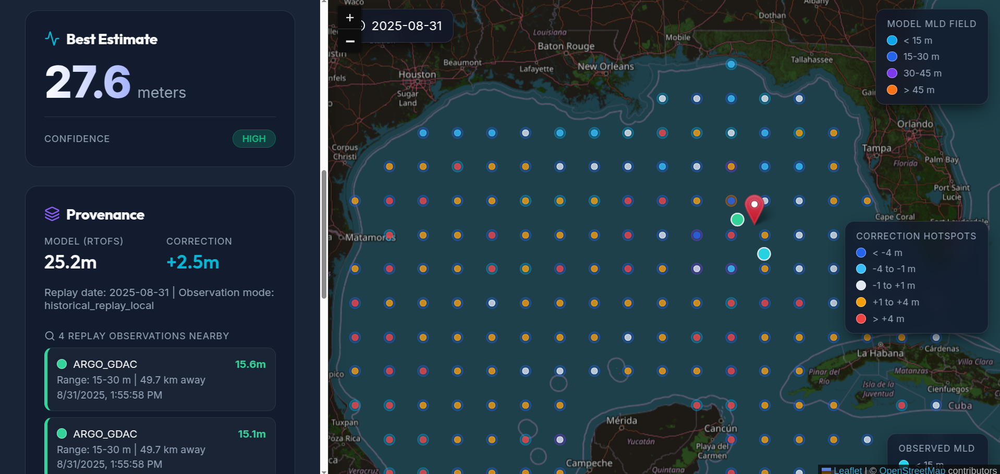

# MLD Historical Replay Prototype

A prototype for machine-learning-corrected mixed layer depth (MLD) estimates in the Gulf of Mexico, developed under the [AQUAVIEW](https://aquaview.org) project at the **Institute for Advanced Analytics and Society, University of Southern Mississippi (USM)**.

**Live prototype:** [https://nondetractively-eery-tony.ngrok-free.dev](https://nondetractively-eery-tony.ngrok-free.dev)



## Motivation

Ocean model forecasts (like NOAA's RTOFS) are the primary tool for understanding current ocean conditions, but they have systematic biases — especially near dynamic features like fronts and eddies. Meanwhile, in-situ observations from Argo floats, gliders, and ship profiles capture what's actually happening, but they're sparse and scattered. Today, a user who wants to know "what's the mixed layer depth here?" gets either a model value with unknown bias or a nearby observation that may not represent their exact location.

This project prototypes the next layer of AQUAVIEW: not just serving data, but **combining model output with in-situ observations via ML to produce estimates that are better than either source alone** — with a clear provenance chain explaining where the answer came from.

MLD was chosen as the first use case because it directly impacts hurricane intensity forecasting, Navy sonar operations, and ocean dynamics research, and because models systematically underresolve frontogenesis-driven MLD shoaling that observations can capture.

## AQUAVIEW and Data Discovery

This project was built to prototype and test [AQUAVIEW](https://aquaview.org) as an ocean data discovery and integration tool. AQUAVIEW's catalog and MCP (Model Context Protocol) interface were used during the research phase to discover and evaluate candidate in-situ observation sources — including WOD profiles, Argo GDAC, IOOS Glider DAC, and ERDDAP endpoints.

The current replay prototype bypasses AQUAVIEW for observation lookup (using pre-built holdout CSVs instead), but the live operational path in `mld_pipeline.py` still integrates with AQUAVIEW for real-time observation search and profile extraction. Completing that live integration remains a key next step.

## Current Prototype

The app is intentionally a **historical replay sandbox**, not a live operational service. It replays a dense Jul-Aug 2025 holdout window where same-day RTOFS model fields and in-situ observations are available, then demonstrates the full product loop: query a point, correct the model estimate, show confidence, and explain provenance.

- **Mode:** historical replay sandbox
- **Replay window:** 2025-07-07 to 2025-08-31
- **Training data:** same-day RTOFS + WOD/Argo rows before 2025-07-07 (796 rows, 48 platforms)
- **Holdout data:** Jul-Aug 2025 Argo rows excluded from training (269 rows, 21 platforms)
- **Frozen replay model:** `artifacts/models/model_historical_replay_2025_jul_aug.pkl`
- **Raw RTOFS holdout:** MAE 7.112m, RMSE 9.274m, R2 -0.003
- **Corrected replay holdout:** MAE 6.431m, RMSE 8.355m, R2 0.186

## What The App Shows

The dashboard lets a user select a replay date, click the Gulf of Mexico map, and inspect an MLD estimate with provenance.

Current map layers include:

- Nearby in-situ observations used for the clicked estimate
- All replay in-situ points for the selected date
- Raw model MLD background field
- ML correction hotspot field
- Final corrected MLD field

The goal is to make the correction explainable, not just numerical: users should see where the model started, which observations informed the estimate, how large the correction was, and how confident the system is.

## Why Historical Replay

The original product idea was a live AQUAVIEW-style endpoint that combines model forecasts with nearby in-situ observations. During discovery, we found that the live in-situ path is not reliable enough yet for real-time ML correction. The historical replay sandbox gives us a truthful MVP:

- RTOFS fields exist for the replay dates.
- In-situ profiles exist for the replay dates.
- The holdout window was excluded from model training.
- The app can demonstrate the intended user experience without pretending to be operationally live.

See `docs/historical_sandbox.md` for the full rationale.

## Run The Replay App

### Local development

From the repo root:

```bash
./scripts/restart_replay_app.sh
./scripts/check_replay_health.sh
```

Then open `http://127.0.0.1:5174/`. The backend runs on `127.0.0.1:8001`; the Vite frontend runs on `127.0.0.1:5174` and proxies API requests to the backend.

### Public access via ngrok

For servers without a public IP, ngrok creates an outbound HTTPS tunnel. This avoids nginx entirely — FastAPI serves both the API and the built frontend on a single port.

First-time setup:

```bash
./scripts/install_ngrok_local.sh
export NGROK_AUTHTOKEN='<your-token>'
./scripts/configure_ngrok_token.sh
./scripts/build_frontend.sh
./scripts/install_user_api_service.sh
./scripts/install_ngrok_user_service.sh
```

Get the public URL:

```bash
./scripts/get_ngrok_url.sh
```

Free ngrok URLs change on tunnel restart. For a stable demo URL, reserve a static domain in ngrok and update `scripts/run_ngrok_tunnel.sh`.

See `docs/ngrok_deployment.md` for the full guide.

## API Reference

The FastAPI backend exposes the following endpoints:

### `POST /mld`

Query an MLD estimate at a point and time.

**Request body:**

```json
{
  "lat": 28.0,
  "lon": -89.0,
  "time": "2025-08-01T12:00:00Z"
}
```

**Response:**

```json
{
  "query_lat": 28.0,
  "query_lon": -89.0,
  "query_time": "2025-08-01T12:00:00Z",
  "best_estimate_mld": 8.66,
  "confidence": "Medium",
  "model_mld": 11.94,
  "correction_applied": -3.29,
  "nearby_observations": [
    {
      "id": "aoml/4903556/profiles/R4903556_157.nc",
      "platform_id": "4903556",
      "obs_time": "2025-08-01T19:08:10Z",
      "distance_km": 88.5,
      "mld_m": 14.8,
      "source": "ARGO_GDAC",
      "lat": 28.106,
      "lon": -88.1061
    }
  ],
  "window_used": "historical_replay_local"
}
```

### `GET /metadata`

Returns replay mode configuration, available dates, and active model path.

### `GET /map_layer?time=<ISO8601>&layer=<name>&stride=<int>`

Returns a sampled spatial field for map rendering. Available layers:

| Layer | Description |
|-------|-------------|
| `model_mld` | Raw RTOFS model MLD field |
| `correction` | ML correction magnitude at each grid point |
| `corrected_mld` | Final corrected MLD (model + correction) |
| `observations` | All replay in-situ observations for the selected date |

### `GET /health`

Returns service status, mode, dataset loaded state, and cache sizes.

## Important Paths

```text
api.py                                      FastAPI replay/runtime API
historical_replay.py                        Replay metadata, date, RTOFS, and holdout helpers
mld_pipeline.py                             MLD estimate pipeline and provenance assembly
mld_core.py                                 Core RTOFS and MLD calculation helpers
mcp_server.py                               MCP wrapper for agent access
mld-dashboard/                              React/Vite/Leaflet frontend
ml/                                         ML processing, training, source, and audit code
artifacts/                                  Frozen models, datasets, audit CSVs, and generated reports
docs/                                       Human-facing prototype docs
scripts/                                    Local run/check helpers
deploy/                                     nginx and systemd service files
NEXT_SESSION_HANDOFF.md                     Working-session continuity notes
CHANGELOG.md                                Historical project log
```

The research-era `ML_baseline/` directory has been split into `ml/` source code and `artifacts/` generated outputs.

## In-Situ Profile Requirements

For the current MLD label, a candidate profile generally needs:

- Gulf of Mexico location
- Timestamp
- Latitude and longitude
- Vertical depth or pressure coordinate
- Temperature values through and below the 10m reference depth
- Enough valid depth-temperature levels to compute a 0.2C threshold MLD
- Observed MLD in a sane range, currently 10-100m for the GoM prototype
- Matching same-day RTOFS availability and successful feature extraction

See `docs/insitu_requirements.md` for details.

## Next Steps

- Complete the live AQUAVIEW integration for real-time observation lookup and MLD correction
- Expand the replay window and training data as more same-day RTOFS + in-situ pairs become available
- Validate correction patterns against known physical dynamics (frontogenesis, eddy-driven MLD shoaling) with domain partners
- Extend the architecture to additional ocean variables beyond MLD

## Prototype Caveats

- This is not a live operational product.
- AQUAVIEW is not the replay observation source; the live integration path still needs work.
- ERDDAP gliders are currently treated as diagnostic/sidecar data because deployment clustering hurt grouped generalization.
- The replay model is prototype-ready for the app, not production accepted.
- The current repo layout still preserves several research artifacts so the analysis trail remains auditable.

## Author

**Suramya Angdembay**
Institute for Advanced Analytics and Society, University of Southern Mississippi

For questions or collaboration: sralimbu@gmail.com

This project is part of the [AQUAVIEW](https://aquaview.org) organization.
